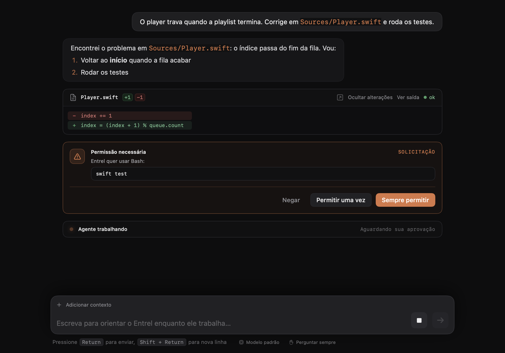

<div align="center">


# Entrel Code

**A camada silenciosa entre você e o Claude Code.**

Um app nativo para macOS que dá ao [Claude Code](https://code.claude.com/docs) uma interface de chat,
sem deixar de ser o Claude Code que você já usa no terminal.




</div>

---

## O que é

O Entrel Code roda o próprio `claude` por baixo, com o mesmo login, as mesmas configurações e as mesmas ferramentas.
A diferença está na interface: em vez de um terminal, você tem uma conversa com cartões para cada ação, diffs
coloridos, aprovações com um clique e tudo o que acontece visível no fluxo.

Quando precisar do terminal de verdade, ele está a um clique: um seletor **Chat | Terminal** troca o modo na hora.

## Recursos

**Conversa**
- Respostas em tempo real, com markdown completo: títulos, listas, tabelas e blocos de código com cores de sintaxe
- Cartões para cada ferramenta (Bash, Read, Edit…), com status e saída expansível
- Edições mostradas como **diff**, inclusive antes de você aprovar
- Subagentes num cartão próprio, com cada passo e o relatório final
- Perguntas de múltipla escolha respondidas direto no chat
- Escreva enquanto o Claude trabalha: a mensagem entra no meio da tarefa

**Controle**
- Permissões com **Negar**, **Permitir uma vez** ou **Sempre permitir**
- Troca de modelo e de modo de permissão (perguntar sempre, aceitar edições, modo plano, automático)
- Modo plano com aprovação do plano antes de começar
- Comandos `/` com sugestões. Os interativos (`/login`, `/config`, `/permissions`…) abrem num terminal por cima do chat
- Uso de contexto e custo estimado no rodapé

**Contexto**
- `@` para mencionar arquivos do projeto
- Arraste arquivos e imagens para a janela, ou cole prints com ⌘V
- Caminhos de arquivo clicáveis nas respostas
- Painel de alterações do git com o diff de cada arquivo

**Histórico**
- Barra lateral com as conversas da pasta: busque, renomeie, apague ou retome qualquer uma
- Edite uma mensagem antiga e continue a partir dali, numa cópia da conversa
- Exporte a conversa em Markdown

**Mac de verdade**
- Abas e várias janelas, cada uma com sua conversa
- Notificações quando uma tarefa longa termina ou quando o Claude precisa de você
- Atalhos de teclado para tudo

## Requisitos

- macOS 13 (Ventura) ou mais recente
- Swift 5.9 ou mais recente (Xcode ou as Command Line Tools)
- [Claude Code](https://code.claude.com/docs) instalado e com login feito (`claude` precisa funcionar no terminal)

## Instalação

```bash
git clone https://github.com/imwiily/entrel-code.git
cd entrel-code
./build.sh
```

O script compila em modo release, gera o ícone, monta o `Entrel Code.app` e instala em `~/Applications`.
Depois é só abrir pelo Launchpad ou pelo Spotlight.

## Como usar

1. Abra uma pasta de projeto (ou arraste a pasta para a janela).
2. Escreva o que você quer. **Return** envia, **Shift + Return** quebra a linha.
3. Aprove ou negue as ações quando o Claude pedir.

### Atalhos

| Atalho | Ação |
| --- | --- |
| ⌘N | Nova conversa |
| ⌘T | Nova aba na mesma pasta |
| ⇧⌘N | Nova janela |
| ⌘O | Abrir pasta |
| ⌘F | Buscar na conversa |
| ⇧⌘E | Exportar a conversa em Markdown |
| ⇧⌘G | Alterações do git |
| ⌘+ / ⌘− / ⌘0 | Tamanho do texto |
| Esc | Interromper o Claude |

## Como funciona

No modo chat, o app conversa com o Claude Code pelo protocolo `stream-json`:

```bash
claude -p --input-format stream-json --output-format stream-json \
          --include-partial-messages --permission-prompt-tool stdio
```

Suas mensagens entram pelo stdin e cada evento (texto, chamadas de ferramenta, pedidos de permissão) volta pelo
stdout como uma linha JSON. As conversas são as mesmas que o Claude Code salva em `~/.claude/projects`,
por isso a barra lateral mostra também as sessões que você abriu pelo terminal.

O modo terminal embute o `claude` interativo com o [SwiftTerm](https://github.com/migueldeicaza/SwiftTerm).

## Estrutura

```
Sources/ClaudeCodeApp/
├── ClaudeCodeApp.swift   # app, menus, janela, modo terminal
├── ChatSession.swift     # protocolo stream-json e estado da conversa
├── ChatView.swift        # interface do chat, cartões e markdown
├── Composer.swift        # campo de mensagem (Return, Shift+Return, colar imagens)
├── Support.swift         # diffs, anexos, histórico, git, notificações
├── GitView.swift         # painel de alterações
├── Highlight.swift       # cores de sintaxe
├── Theme.swift           # cores, marca >_ e componentes visuais
└── Welcome.swift         # tela inicial e indicador de status
scripts/make-icon.swift   # gera o ícone do app
build.sh                  # compila e instala
```

Para desenvolver, `swift build` compila em modo debug e `./build.sh` gera e instala o app.

## Identidade visual

Grafite quente, bordas finas e um único acento terracota (`#D97745`). Texto em SF Pro e código em SF Mono.
A marca `>_` é um prompt com o cursor aceso.

---

<div align="center">
<sub>Projeto independente, sem vínculo com a Anthropic. Claude e Claude Code são marcas da Anthropic.</sub>
</div>
